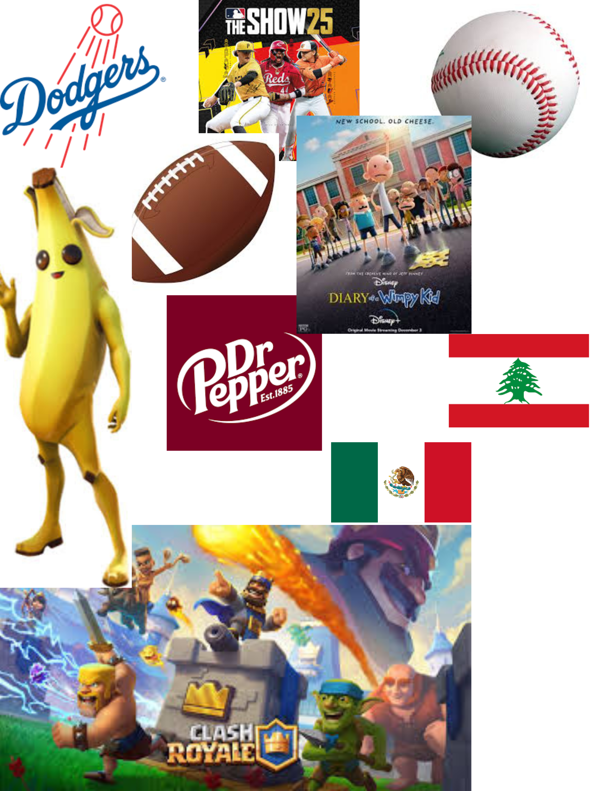

# Me in Markdown
## Introduction: My name is Santana Gonzalez and I am in the Tenth Grade. I like playing sports and I am currently playing football for the Chatsworth football team. My favorite food are chicken sandwiches and my favorite drink is Dr Pepper. I like collecting things like baseball or pokemon cards. My favorite movie is called Moneyball and it is about rebuilding a really bad baseball team. 
## During this last summer I traveled to Cabo San Lucas in Mexico for my birthday. My most memorable moments from this summer are the football summer workouts because they were brutal. For this school year I hope to get striaght A's in all of my classes to maintain my 4.0 GPA. I hope to have a lot of fun in this class and pass the AP test. My favorite book is Diary of a Wimpy kid because I have been reading them since I was little.
## My favorite baseball team is the Los Angeles Dodgers. My favorite player on the Dodgers is Freddie Freeman. I also like to play video games like Fortnite, Minecraft, MLB the Show, but my favorite is Clash Royale. I am excited to get my drivers permit so I can start driving. I like to hangout with my friends anywhere but mostly the mall.

## [Click here to see my playlist](https://open.spotify.com/playlist/6mnGZ8v0HPaaHas2MuznXS?si=WXbA_YhnTYu4zTUyaU_NuQ)

## 